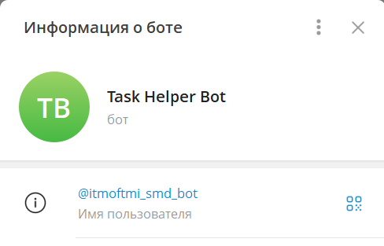
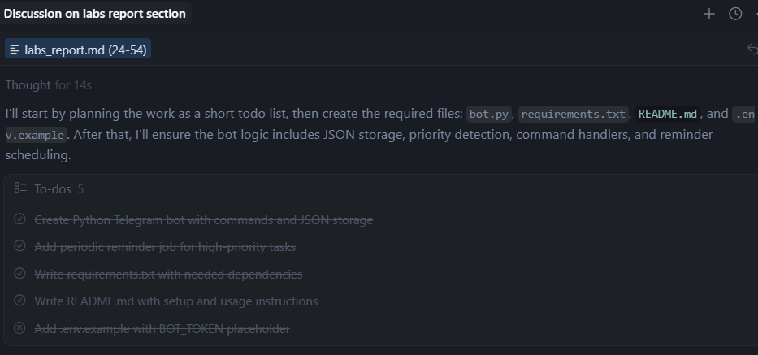
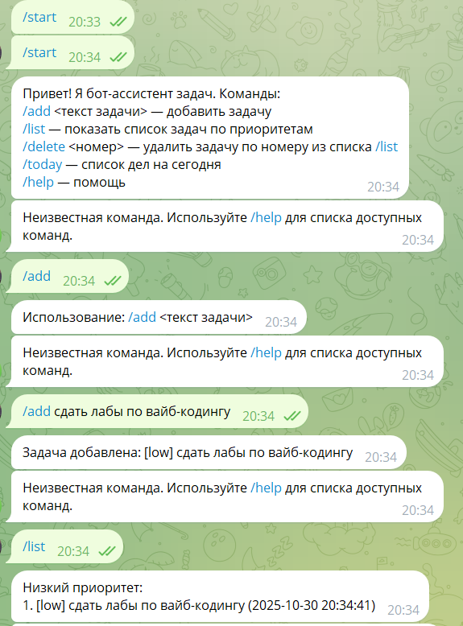
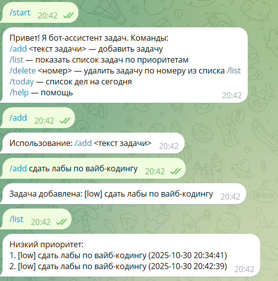
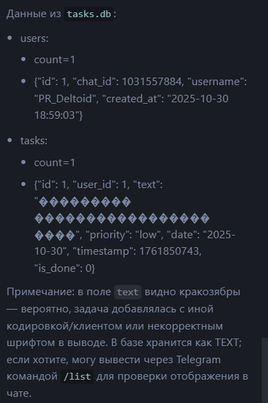
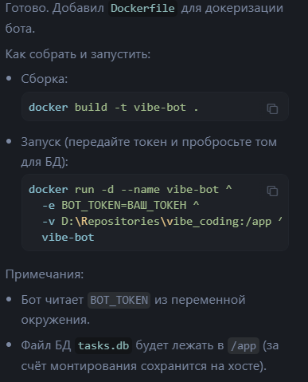

University: ITMO University  
Faculty: FTMI  
Course: Vibe Coding: AI-боты для бизнеса  
Year: 2025/2026  
Group: U4225  
Author: Shumakova Maria  
Lab: Lab1, Lab2, Lab3  
Date of create: 26.10.2025  
Date of finished: 30.10.2025  

### Лабораторная работа 1
Первым шагом выберем сценарий для бота. Я выбрала "Бот-ассистент для задач":

- Принимает задачи в текстовом виде
- Организует их по приоритетам
- Отправляет напоминания
- Формирует списки дел

Создадим пустого бота через BotFather



Опишем промпт для бота

```
Создай Telegram-бота на Python с использованием библиотеки python-telegram-bot.

Функционал бота-ассистента для задач:
- Принимает задачи от пользователя в виде текстовых сообщений;
- Сохраняет задачи с временной меткой;
- Организует задачи по приоритетам (высокий / средний / низкий), при этом приоритет определяется из текста задачи (например, если есть слова “срочно”, “важно” — приоритет высокий);
- Позволяет просмотреть список задач по приоритетам с помощью команды /list;
- Позволяет удалить задачу по номеру через команду /delete;
- Отправляет напоминания о задачах с высоким приоритетом через определённый интервал времени;
- Формирует список дел на день по команде /today.

Команды бота:
/start — приветствие и краткая инструкция
/add — добавление задачи (текст задачи указывается сразу после команды)
/list — просмотр списка задач по приоритетам
/delete — удаление задачи по её номеру
/today — сформировать список дел на сегодня
/help — помощь по всем командам

Технические требования:
- Хранить данные задач в формате JSON (внутри tasks.json);
- Обработка ошибок (например, если пользователь вводит неправильный номер задачи при удалении);
- Структурированный и комментированный код;
- Логика разделена по функциям;
- Использование .env файла для хранения токена.

Создай следующие файлы:
bot.py — код бота;
requirements.txt — список зависимостей;
README.md — инструкция по запуску бота (как создать бота, где взять токен, как запустить);
.env.example — пример содержимого конфигурационного файла (с ключом BOT_TOKEN).
```

Скармливаем боту промпт и получаем готовую архитектуру



Даем задание установить зависимости и запустить бота. Проверим на функциональность



После каждого ответа бот посылает сообщение о неизветсной команде. Говорим курсору, что это нужно исправить

```
После выполнения команды бот вылает результат а далее пишет, что команда неизвестна. Пример:
Запрос 
/list
Ответ
Низкий приоритет:
1. [low] сдать лабы по вайб-кодингу (2025-10-30 20:34:41)
Неизвестная команда. Используйте /help для списка доступных команд.
```

Курсор исправляет ошибку и перезапускает бота. Посмотрим на результат



### Лабораторная работа 2
Для улучшения бота я выбрала интеграцию с простой базой данных. К моменту реализации лабораторной 1 бот записывает все таски в tasks.json. Напишем промпт для внедрения БД:

```
Улучши моего Telegram-бота, добавив работу с SQLite вместо хранения задач в JSON.

Текущий функционал бота:
Бот-ассистент задач принимает текст задач, определяет приоритет по ключевым словам («срочно», «важно» и т.д.), сохраняет их в tasks.json, группирует по приоритету и присылает напоминания каждые 15 минут о задачах с высоким приоритетом.
Поддерживаемые команды:
/start — приветствие и краткая инструкция
/add <текст> — добавить задачу
/list — показать список задач, сгруппированных по приоритетам
/delete <номер> — удалить задачу
/today — показать задачи на сегодня
/help — справка

Новый функционал:
Перевести хранение данных с JSON на SQLite.
Создать несколько таблиц, например:
- users — id, chat_id, username, created_at
- tasks — id, user_id, text, priority, date, timestamp, is_done
При добавлении задачи бот должен автоматически создавать запись пользователя, если его ещё нет в таблице users.
Команда /done <номер> — пометить задачу как выполненную.
Команда /clear — удалить все выполненные задачи.
Напоминания должны использовать данные из БД.

Данные:
Структура таблиц:
CREATE TABLE users (
    id INTEGER PRIMARY KEY AUTOINCREMENT,
    chat_id INTEGER UNIQUE,
    username TEXT,
    created_at TIMESTAMP DEFAULT CURRENT_TIMESTAMP
);

CREATE TABLE tasks (
    id INTEGER PRIMARY KEY AUTOINCREMENT,
    user_id INTEGER,
    text TEXT,
    priority TEXT,
    date TEXT,
    timestamp INTEGER,
    is_done INTEGER DEFAULT 0,
    FOREIGN KEY (user_id) REFERENCES users (id)
);


Требования:
Код должен быть простым и понятным.
Использовать только стандартную библиотеку Python (sqlite3).
Добавить обработку ошибок при работе с БД.
Сохранить существующий функционал бота.
Добавить понятные комментарии в код.
Структурировать проект (например, db.py для логики БД).

Создай:
bot.py — обновлённый файл Telegram-бота с поддержкой SQLite.
db.py — модуль для работы с БД (инициализация, добавление/удаление задач, выборка).
README.md — обновлённый с описанием структуры таблиц, новых команд и инструкции по запуску.
```

Курсор добавил файл db.py, модифицировал bot.py requirements.txt и README файл.

Проверим, что бот корректно работает с БД, дадим задачу курсору вывести информацию из БД:

```
Выведи информацию из таблиц users и tasks
```

Вот результат:



### Лабораторная работа 3

В качестве выполнения лабораторной работы 3 я выбрала 3 вариант развертывания бота:

> 3. Docker + VPS (продвинутый) - Контейнеризация бота - Запуск на своем сервере - Полный контроль - Требует больше знаний

Начнем с создания Dockerfile и обертки файлов в контейнер. Напишем боту промпт:

```
Создай Dockerfile для докеризации бота
```

Курсор выдал ответ:



Далее после создания запушим изменения в репозиторий, склонируем его через SSH на VDS, в папке репозитория создадим .env с токеном бота и запустим сборку

Список команд для выполнения на VPS:

```
git clone https://github.com/Maria144-dev/vibe_coding.git
cd vibe_coding/
touch .env && nano .env
docker build -t vibe-bot .
docker run -d --name vibe-bot --restart unless-stopped \
  --env-file .env \
  -v "$(pwd):/app" \
  vibe-bot
 ```

 Теперь бот висит как фоновый контейнер
 
 
 #### Ссылка для тестирования бота: *@itmoftmi_smd_bot*